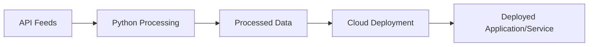

# litbms 🚀
a lightweight web3 enabled business management solution

## Business Opportunity 💸
- Large CRM Providers require expensive & long term contracts leaving market share for flexible + nimble solutions 💰
- Enable crypto/defi functions to aid running your business 🎬
- Example: Invoice in 80% cash = 20% crypto
- Create a flexible Python based Business Management Services framework for Small to Medium sized businesses

## SDLC LifeCycle: Dev 🚝 

## Payment/Donation Accepted via Stripe	💳

[Stripe Payment Integration](https://buy.stripe.com/test_28o7vCedu9ZgggM9AD)

## Market Sizing of Enterprise Business Solutions 📈
- **Market Size:**
  - $49.6 Billion Revenue
  - CAGR: 1.7%
- **Market Share:**
  - 50% from 5 companies like **Salesforce**
- Enable with **crypto** & **AI** to smartly upset & analyze your business

## Tech Stack 📡
- Python
- Streamlit Hosting
- ☁️ Cloud Provider Integrations:
  - AWS 
  - Azure 
  - Google Cloud

## Deployment Architecture

